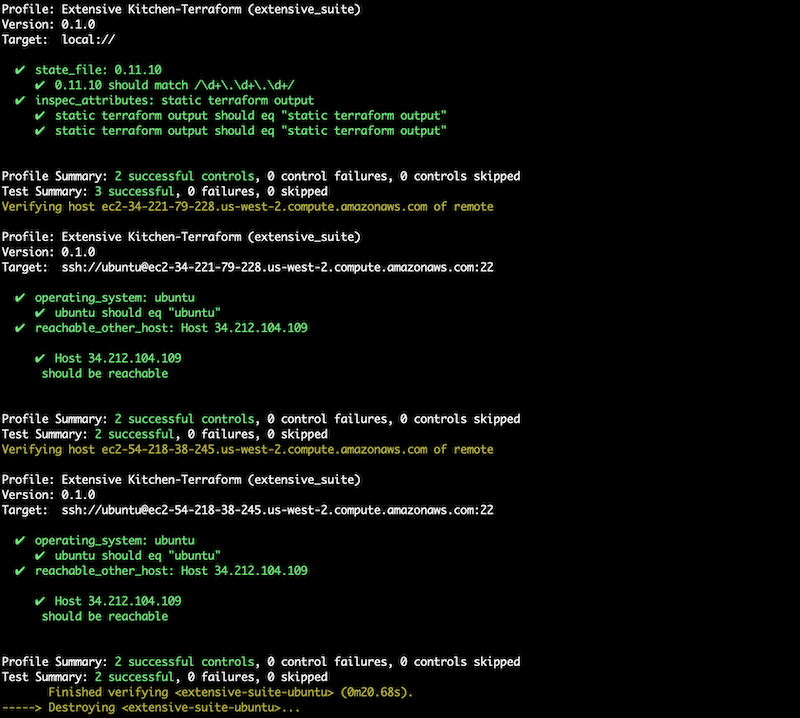

# Kitchen-Terraform - extensive example

A project to demonstrate an extensive test of a Terraform module that creates AWS network and EC2 resources.

Kitchen-CI with Kitchen-Terraform is used invoke the module in a terraform configuration and then test the created resources.

## Prerequisites

### Install Terraform

Terraform installation [instructions](https://www.terraform.io/downloads.html)

### AWS setup

Need to have a user with API access allowed to modify VPC and EC2 resources in us-east-1 and us-west-2 regions.

The API Key ID and Secret can be set by:

* Add them to environment variables
  * `export AWS_ACCESS_KEY_ID=your_access_key_id`
  * `export AWS_SECRET_ACCESS_KEY=your_secret_key`
* Create a default AWS shared credentials file - `~/.aws/credentials`

### Set up rbenv - instructions for MAC

It is recommended to use rbenv or another Ruby versions manager.

* Install rbenv - run `brew install rbenv`
* Initialize rbenv - add to `~/.bash_profile` line `eval "$(rbenv init -)"`
* Run `source ~/.bash_profile`
* Install ruby 2.3.1 with rbenv - run `rbenv install 2.3.1` , check `rbenv versions`
* Set ruby version for the project to 2.3.1 - run `rbenv local 2.3.1` , check `rbenv local`

### Install Ruby gems from Gemfile

* Install bundler - run `gem install bundler`
* Refresh rbenv - run `rbenv rehash`
* Install gems from Gemfile - run `bundle install`

### Generate ssh key pair

Generate a ssh key pair which will be used to create an AWS EC2 key pair to add to the EC2 instances.

* Run `ssh-keygen -t rsa -b 4096 -N "" -f test/assets/key_pair`
* On MAC OS you may need to add the key to ssh-agent - run `ssh-add test/assets/key_pair`

## Run Kitchen-CI tests

Kitchen-CI is configured to test the Terraform module by building it using a CentOS ami in us-east-1 region and an Ubuntu ami in us-west-2 region. The different platforms need to be tested separately as they need a different value of `AWS_DEFAULT_REGION` environment variable in order to be built.

### Testing the CentOS platform

* set the AWS default region to us-east-1 - `export AWS_DEFAULT_REGION=us-east-1`
* List kitchen environment - `bundle exec kitchen list [all|centos]`
* Build kitchen environment - `bundle exec kitchen converge centos`
* Run kitchen tests - `bundle exec kitchen verify centos`
* Destroy kitchen environment - `bundle exec kitchen destroy centos`
* Automatically build, test, destroy - `bundle exec kitchen test centos`

### Testing the Ubuntu Platform

* set the AWS default region to us-east-1 - `export AWS_DEFAULT_REGION=us-west-2`
* List kitchen environment - `bundle exec kitchen list [all|ubuntu]`
* Build kitchen environment - `bundle exec kitchen converge ubuntu`
* Run kitchen tests - `bundle exec kitchen verify ubuntu`
* Destroy kitchen environment - `bundle exec kitchen destroy ubuntu`
* Automatically build, test, destroy - `bundle exec kitchen test ubuntu`

Successful Kitchen-CI tests should look like:

